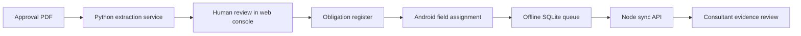

# Rook Compliance

Rook is a proof-of-work product built for a simple problem: environmental consultants receive dense approvals and permits, then must turn those documents into recurring work, collect reliable evidence in the field, and prove what happened later.

It is deliberately one coherent product—not a pile of unrelated portfolio demos:

- **Rook Console** is the office web app for facilities, obligations, document review, workflow status, and field evidence.
- **Rook Field** is the Android companion for assigned inspections, checklists, readings, photos, GPS, and offline sync.
- **Rook API** connects both clients through GraphQL and an idempotent mobile sync endpoint.
- **Rook Document Intelligence** extracts draft obligations from text or PDFs and always requires human approval.

All companies, facilities, people, approvals, and readings in this repository are synthetic. This independent demonstration is not a Corvus Consulting product and does not imply access to any private client information.

## The environmental idea, in plain English

An environmental approval is partly a rulebook for a facility. It may say things like “inspect this discharge point every month,” “keep these lab records for five years,” or “submit this report by March 31.”

The hard part is not merely reading the sentence. Someone must:

1. find each commitment in a long document;
2. decide what it means operationally;
3. assign it, schedule it, and define acceptable evidence;
4. let a field worker complete the task where cellular service may be poor;
5. review the returned evidence; and
6. preserve a traceable history for the client and regulator.

Rook makes that chain visible. The AI is an assistant at step 1, never the environmental decision-maker.

## Why this project fits the role

The role asks for ownership from an unclear brief through architecture, design, implementation, testing, deployment, and ongoing support. Rook demonstrates the same shape of work with the listed stack:

| Need in the role | Evidence in Rook |
|---|---|
| Next.js, React, TypeScript | Interactive consultant console |
| Node.js and APIs | GraphQL Yoga plus mobile REST sync |
| Relational data and Prisma | PostgreSQL-ready schema with operational relationships |
| Python and AI/data pipelines | Citation-bearing PDF/text extraction service |
| Mobile apps | Expo/React Native Android app |
| Production judgment | Docker, reverse proxy, health checks, environment config, CI |
| Practical UX | Human approval gates, explainable readiness, visible offline queue |
| Ambiguous requirements | [Decision record](docs/DECISIONS.md) explains the product and technical trade-offs |

## System map



## What is implemented

The web demo includes:

- portfolio readiness metrics and explainable facility scores;
- Recharts facility visualization;
- a dnd-kit obligation workflow board;
- approval proposals with page citations, confidence, accept/reject/change-decision states;
- accepted proposals appearing back in the register;
- a field-submission review screen; and
- live API connectivity detection with a graceful demo fallback.

The Android app includes:

- a standalone arm64 APK in the [v0.1.0 GitHub release](https://github.com/yazanbaker94/rook-compliance/releases/tag/v0.1.0), configured for the live `/corvus` API;
- on-device SQLite assignment and submission storage;
- an offline/online status indicator;
- inspection checklists and readings;
- camera evidence and optional GPS capture;
- a visible queued/synced record list;
- retry-safe sync using a unique local record ID; and
- an internal APK build profile in `eas.json` for managed follow-up builds.

The services include:

- GraphQL facilities, obligations, proposals, dashboard, submissions, review mutations, and sync mutation;
- lightweight REST endpoints for health, mobile bootstrap, and mobile sync;
- a Prisma/PostgreSQL production data model;
- PDF and text extraction with page-level source evidence;
- validation at every external input boundary; and
- tests for proposal decisions, idempotent sync, and extraction.

## Run locally

Requirements: Node.js 22+, Python 3.12+, and Expo Go or an Android emulator.

```powershell
npm --prefix apps/web install
npm --prefix services/api install
npm --prefix apps/mobile install
python -m pip install -r services/ai/requirements.txt

npm run dev:api
npm run dev:web
```

Open [http://localhost:3000](http://localhost:3000). In separate terminals:

```powershell
python -m uvicorn app.main:app --app-dir services/ai --reload --port 8000
npm run dev:mobile
```

For a physical Android phone, the checked-in default uses the public production API at `https://swoop.video/corvus`. For local-only development, copy `.env.example` to `.env` and override `EXPO_PUBLIC_API_URL` with your computer's LAN address over trusted Wi-Fi. Android emulators can use `http://10.0.2.2:4000`.

## Verify everything

```powershell
npm run verify
```

This builds the web app, tests the API, type-checks the Android app, and tests the Python extractor.

See the dated [verification record](docs/VERIFICATION.md) for build, runtime smoke-test, Expo Doctor, Android bundle, audit, and container-validation details.

## Production deployment

The live portfolio is served at [swoop.video/corvus](https://swoop.video/corvus). The existing Swoop product remains at the domain root. Docker Compose runs the web app, Node API, Python service, and PostgreSQL on the VPS. The VPS binds application ports only to localhost. A path-scoped Cloudflare Worker forwards only `/corvus*` to a token-protected Caddy origin, so the raw server address cannot bypass the proxy.

```bash
cp .env.example .env
# Replace POSTGRES_PASSWORD with a generated secret.
docker compose up -d --build
docker compose ps
```

Under the public `/corvus` prefix, Caddy routes the web app, GraphQL at `/corvus/graphql`, mobile endpoints at `/corvus/api/mobile/*`, and the extraction service at `/corvus/document-ai/*`. GitHub Actions verifies every push; the deployment workflow updates the VPS only after verification succeeds.

The production API uses Prisma migrations and PostgreSQL persistence seeded exclusively with deterministic synthetic data. Authentication, object storage, backups, monitoring, and client data-residency controls remain explicit prerequisites before this demonstration could hold real client information. See the [VPS runbook](docs/VPS-RUNBOOK.md).

## Recruiter walkthrough

Use the focused [four-minute demo script](docs/DEMO-SCRIPT.md). It tells one story from approval PDF to accepted obligation to offline Android evidence and consultant review.

## Repository layout

```text
apps/web        Next.js/Vinext consultant console
apps/mobile     Expo/React Native Android field app
services/api    Node.js, GraphQL Yoga, Prisma schema
services/ai     FastAPI PDF/text extraction service
infra           Caddy reverse-proxy configuration
docs            decisions, demo script, and VPS runbook
```
